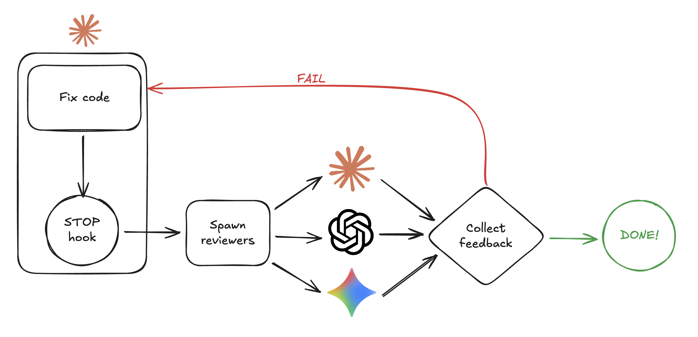

# Cerberus

Three-headed guardian of code quality.

Cerberus is a multi-model review and debate plugin for Claude Code and Codex
CLI. It runs Codex, Gemini, Claude, or any configured roster of those reviewers
against code, plans, specs, task lists, architecture questions, and open-ended
prompts. v2 uses one Go binary, `bin/cerberus`, on both hosts.



## Documentation Map

- [Codex host guide](docs/CODEX.md)
- [v2 rebuild spec](docs/2026-05-08-rebuild-spec.md)
- [v2 rebuild plan](docs/2026-05-08-rebuild-plan.md)

## What Ships In v2

- One runtime binary: `bin/cerberus`
- Claude Code and Codex CLI plugin packaging
- Built-in default panel: one Claude, one Codex, one Gemini reviewer
- YAML rosters for multi-instance and multi-version panels
- First-class debate through `--debate`
- Lazy local build on first invocation after clone or upgrade
- Host-neutral environment contract through `CERBERUS_*`

The v2.0.0 GA cut should advertise `2.0.0` in both plugin manifests and in the
marketplace entry before tagging `v2.0.0`.

## Requirements

Install the reviewer CLIs you want Cerberus to use:

| Tool | Purpose |
| --- | --- |
| `claude` | Claude reviewer and Claude Code host |
| `codex` | Codex reviewer and Codex CLI host |
| `gemini` | Gemini reviewer |
| `make` | Local lazy build trigger |
| `go` | Builds `bin/cerberus`; Go 1.22 or newer |

The built-in default panel drops unavailable reviewer CLIs with one stderr
warning per missing CLI. Custom YAML rosters are strict: if a selected custom
roster names an unavailable provider, preflight rejects the run.

### Reviewer CLI Contract

The mock CLIs under `tests/mocks/` intentionally validate the same
non-interactive flags Cerberus passes to the real reviewer CLIs. The current
contract was checked against these installed versions:

| Tool | Verified version | Cerberus invocation shape |
| --- | --- | --- |
| `claude` | `2.1.138 (Claude Code)` | `claude --print --output-format json [--model <model>] --append-system-prompt <system>` |
| `codex` | `codex-cli 0.130.0` | `codex exec --json --model <model> <system>` |
| `gemini` | `0.40.0` | `gemini --output-format json --model <model> --prompt <system> --policy <policy.toml>` |

After upgrading any reviewer CLI, run:

```bash
go test ./tests/integration -run TestProviderCLIContractMatchesMocks -v
```

If that contract changes, update `internal/reviewer/spawn.go`, the mock
argument validation in `tests/mocks/internal/replay`, and this table together.

## Install

### Claude Code

Add the marketplace and install the plugin:

```bash
/plugin marketplace add charlieyou/cerberus
/plugin install cerberus
```

On the first Cerberus command or Stop hook, the plugin builds `bin/cerberus`
locally if needed. You can also build up front from a checkout:

```bash
make build
```

Start with the default panel:

```text
/cerberus:review-code
```

That command is the fresh-install smoke path: it resolves the built-in panel,
performs the lazy build if needed, and starts a standard code review.

### Codex CLI

Install the same plugin tree for Codex CLI and enable the bundled hooks. The
host-specific details live in [docs/CODEX.md](docs/CODEX.md); the user-facing
commands are the same after installation:

```text
/cerberus:review-code
/cerberus:review-code --debate
/cerberus:review-code --roster diverse-codex
```

Both hosts execute the same `bin/cerberus` binary and read the same roster
files. Keep one active Cerberus review per project at a time; v2.0.0 does not
include advisory locking around gate state.

## Environment Contract

v2 reads the `CERBERUS_*` contract below. `CLAUDE_PLUGIN_ROOT` is honored only
as a fallback for `CERBERUS_ROOT`.

| Variable | Meaning |
| --- | --- |
| `CERBERUS_ROOT` | Plugin or checkout root containing `bin/cerberus` |
| `CERBERUS_HOST` | `claude`, `codex`, or `generic` |
| `CERBERUS_RUN_KEY` | Stable identity for the active Cerberus run |
| `CERBERUS_SESSION_ID` | Host session or thread id |
| `CERBERUS_STATE_ROOT` | Base directory for Cerberus state |
| `CERBERUS_PROJECT_KEY` | Stable workspace key under the state root |
| `CERBERUS_TRANSCRIPT_PATH` | Optional host transcript path |

State is written under:

```text
<CERBERUS_STATE_ROOT>/<CERBERUS_PROJECT_KEY>/<CERBERUS_RUN_KEY>/
```

Per-iteration artifacts live below `iterations/<N>/`, with run telemetry in
`run-telemetry.json`.

## Commands

### Review Code

```text
/cerberus:review-code
/cerberus:review-code --base main
/cerberus:review-code --commit abc123
/cerberus:review-code main..feature
/cerberus:review-code --mode fast
/cerberus:review-code --consensus all
```

### Review Plans, Specs, Tasks, And Epics

```text
/cerberus:review-plan docs/plan.md
/cerberus:review-spec docs/spec.md
/cerberus:review-tasks TODO.md
/cerberus:verify-epic docs/epic.md
```

### Ask, Healthcheck, And Architecture Review

```text
/cerberus:ask "Should we ship this design?"
/cerberus:healthcheck
/cerberus:architecture-review
```

### Create Specs, Plans, And Tasks

```text
/cerberus:create-spec
/cerberus:create-plan --from-spec docs/spec.md
/cerberus:create-tasks --beads docs/plan.md
```

### Direct CLI

The skills call the binary for you. Direct use is mainly for automation:

```bash
${CERBERUS_ROOT}/bin/cerberus spawn-code-review --mode smart
${CERBERUS_ROOT}/bin/cerberus wait --json --session-key "$CERBERUS_RUN_KEY"
${CERBERUS_ROOT}/bin/cerberus status --json
${CERBERUS_ROOT}/bin/cerberus resolve --reason "manual clear"
${CERBERUS_ROOT}/bin/cerberus generate /tmp/create-plan-drafts \
  --type create-plan \
  --prompt-file prompt.md
```

## Review Flags

| Flag | Use |
| --- | --- |
| `--mode fast\|smart\|max` | Trade off speed and depth |
| `--debate` | Run multi-round debate; requires at least two reviewers |
| `--roster <name>` | Select a YAML roster by name |
| `--reviewer provider:model[:strategy]` | Append a reviewer slot inline |
| `--replace-slot <instance_id>` | Replace a file slot with `--reviewer` |
| `--consensus majority\|all\|any` | Choose aggregation policy |
| `--max-rounds <N>` | Limit review iterations or debate rounds |
| `--agents claude,codex,gemini` | Built-in provider shorthand |

`--agents` is a compatibility shortcut. Prefer rosters for multi-version
reviewers, repeated providers, strategies, and personas. `--agents` is mutually
exclusive with `--roster` and `--reviewer`.

## Roster Configuration

Roster files let you define named reviewer panels without editing source code.
Cerberus resolves them in this order:

1. `./.cerberus/rosters.yaml`
2. `$XDG_CONFIG_HOME/cerberus/rosters.yaml`
3. `~/.cerberus/rosters.yaml`
4. Built-in default panel if no roster file is present

A project roster overrides a user roster with the same name. If a roster file is
present but the requested roster is missing, Cerberus fails preflight instead of
falling back silently.

### Schema

```yaml
version: 1
defaults:
  mode: smart
  max_rounds: 3
rosters:
  name:
    reviewers:
      - provider: codex
        model: gpt-5.5
        strategy: verification-first
        mode: smart
        persona: personas/security.md
```

Allowed providers are `claude`, `codex`, and `gemini`. `strategy`, `mode`, and
`persona` are optional. Persona files are resolved relative to the roster file
and must exist. `consensus` is a CLI flag, not a roster YAML key.

Cerberus assigns instance IDs after resolving the roster:

```text
claude#1
codex#1
codex#2
gemini#1
```

Duplicate provider/model/strategy triples are allowed and become separate
instances. Exact duplicates emit a warning because they are often accidental.

### Default Roster Example

Create `~/.cerberus/rosters.yaml`:

```yaml
version: 1
defaults:
  mode: smart
  max_rounds: 3
rosters:
  default:
    reviewers:
      - provider: claude
        model: opus
      - provider: codex
        model: gpt-5.5
      - provider: gemini
        model: gemini-3.1-pro
```

Then run:

```text
/cerberus:review-code
```

Because this `default` roster is user-authored, it is strict. If any listed CLI
is missing, Cerberus rejects the run instead of dropping that reviewer.

### Custom Multi-Instance Roster

Create `./.cerberus/rosters.yaml` in a project:

```yaml
version: 1
defaults:
  mode: smart
  max_rounds: 3
rosters:
  diverse-codex:
    reviewers:
      - provider: codex
        model: gpt-5.5
        strategy: verification-first
      - provider: codex
        model: gpt-5.4
        strategy: falsification-first
      - provider: codex
        model: gpt-5.3-codex
        strategy: decompose
      - provider: gemini
        model: gemini-3.1-pro
      - provider: claude
        model: opus
        strategy: synthesis
```

Run it:

```text
/cerberus:review-code --roster diverse-codex
```

Append another slot inline:

```text
/cerberus:review-code --roster diverse-codex --reviewer codex:gpt-5.5:verification-first
```

Replace a file-defined slot:

```text
/cerberus:review-code \
  --roster diverse-codex \
  --replace-slot codex#2 \
  --reviewer codex:gpt-5.5:decompose
```

Inline reviewers use `provider:model[:strategy]`. Use YAML when you need a
persona or per-slot mode.

## Debate

`--debate` turns a review or ask command into a multi-round panel. It is off by
default because it costs more time and tokens than single-pass review.

```text
/cerberus:review-code --debate
/cerberus:review-plan --debate docs/plan.md
/cerberus:review-spec --debate docs/spec.md
/cerberus:verify-epic --debate docs/epic.md
/cerberus:ask --debate "Which migration path is safer?"
```

Debate requires at least two reviewers after roster resolution. A one-reviewer
panel is valid for non-debate review and rejected for debate.

## Lazy Build

`bin/cerberus` is a local build artifact. A fresh checkout or upgraded plugin
may not have a current binary yet. Every skill and hook performs the same lazy
build check before executing:

1. Resolve the plugin root from `CERBERUS_ROOT`, `CLAUDE_PLUGIN_ROOT`, or
   `PLUGIN_ROOT`.
2. Check that `make` is available.
3. Run `make -q -C "$root" build` to decide whether the binary is current.
4. If the binary is missing or stale, check that Go is available.
5. Run `make -C "$root" build`.
6. Execute `bin/cerberus`.

The first invocation after clone or upgrade usually spends 10-30 seconds in the
build. During that build, Cerberus writes status to stderr:

```text
cerberus: building... (this happens once after clone or upgrade)
cerberus: build complete in <N>s
```

The second line is the build-duration line. If it never appears, inspect the
stderr immediately above it for the underlying `make` or Go error.

## Troubleshooting

### Plugin Root Is Not Set

Signature:

```text
cerberus: plugin root not set
```

Set `CERBERUS_ROOT` to the plugin or checkout root. Claude installs can also
fall back to `CLAUDE_PLUGIN_ROOT`; Codex plugin hooks normally provide
`PLUGIN_ROOT`.

### Missing Make

Signature:

```text
cerberus: make not found on PATH; install make and retry.
```

Install `make`, restart the host if PATH changed, and invoke the command again.

### Missing Go

Signature:

```text
cerberus: Go >= 1.22 not found on PATH; install Go and retry.
```

Install Go 1.22 or newer. Cerberus does not create gate state when the lazy
build cannot start.

### Make Query Exit 2

`make -q` uses exit code 1 for "target is stale" and exit code 2 for errors such
as a malformed Makefile or missing target. v2.0.0 treats both as "try a real
build", so the final error comes from `make build`.

Common signatures:

```text
make: *** No rule to make target 'build'.  Stop.
Makefile:<line>: *** missing separator.  Stop.
```

Fix the Makefile or reinstall the plugin. Re-run after the build target works.

### Broken Build

Signature:

```text
cerberus: building... (this happens once after clone or upgrade)
go build ...
```

The Go compiler error after `go build` is the source of truth. Fix the checkout
or reinstall the plugin, then run:

```bash
make build
```

### Concurrent First Build

Two simultaneous invocations on a fresh checkout can both start `make build`.
v2.0.0 does not serialize those builds. One invocation may fail once with:

```text
text file busy
exec format error
```

Wait for the other build to finish, then re-run the command.

### Concurrent Gate State

Cerberus is designed for one active run per project. If another pending run is
already present, spawn emits a warning similar to:

```text
cerberus: warning: active gate already pending for this project
```

Resolve or clear the existing run before starting another review in the same
workspace.

### Custom Roster References A Missing CLI

Signature:

```text
roster preflight <path> roster "<name>" slot <n>: provider CLI "<provider>" is not available on PATH
```

Install the named provider CLI or remove that reviewer from the selected roster.
Only the built-in default panel drops missing provider CLIs automatically.

### Debate With One Reviewer

Signature:

```text
--debate requires at least 2 reviewers in the resolved roster (got <n>); see docs/debate.md for rationale
```

Install another provider CLI, pick a larger roster, or remove `--debate`.

### Missing Persona File

Signature:

```text
roster preflight <path> roster "<name>" slot <n>: persona file "<path>" does not exist
```

Fix `persona` in the roster or create the referenced file.

## Rollback To v1.54.x

v2 writes state that v1 does not migrate. A v2 -> v1 downgrade is therefore a
recovery path, not a supported in-place migration.

To recover a Claude install:

```text
/plugin update cerberus --version 1.54.x
```

If the marketplace entry is managed manually, pin the v1 entry in
`.claude-plugin/marketplace.json` to the desired `1.54.x` release before
updating.

Then remove v2-written state for the affected run:

```bash
rm -rf ~/.claude/projects/<project-hash>/cerberus/<run-key>
```

Use the same pattern for a custom state root:

```bash
rm -rf "$CERBERUS_STATE_ROOT/<project-key>/<run-key>"
```

After rollback, update any automation to invoke the v1 surface again. v2's
`CERBERUS_*` environment variables remain the documented v2 contract.
